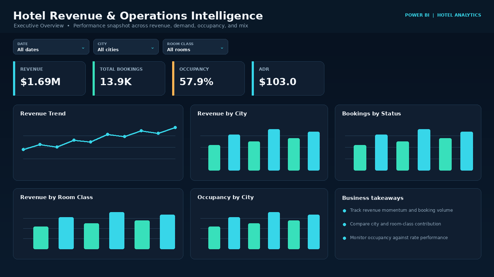
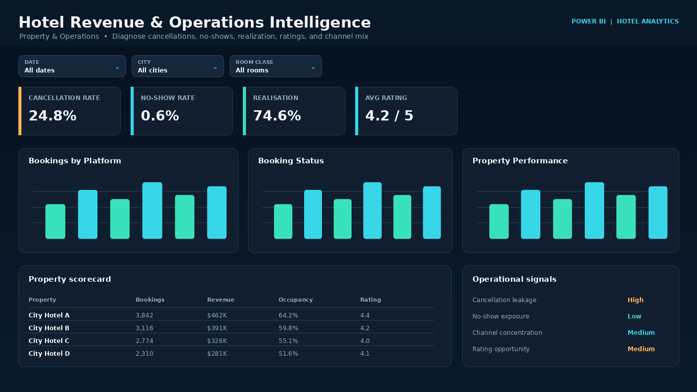

# Hotel Revenue & Operations Intelligence

A Power BI portfolio project that turns hotel booking data into an executive view of revenue performance and an operational view of property-level opportunities. The deliverable is packaged as a **single PBIX file** for easy review in Power BI Desktop.

## Dashboard previews

### Executive Overview

The executive page brings together revenue, total bookings, occupancy, ADR, revenue trends, city contribution, room-class mix, and booking status.

### Property & Operations

The operations page focuses on cancellation and no-show exposure, realisation, ratings, booking platforms, booking status, and a property scorecard.

## Included deliverable

- [`Hotel_Revenue_Operations_Intelligence.pbix`](Hotel_Revenue_Operations_Intelligence.pbix) — packaged Power BI report with the dashboard pages, data model, measures, visuals, theme, and embedded report assets.
- [`previews/`](previews/) — recruiter-friendly static previews of the report pages.

## Key analytical areas

| Area | Examples |
|---|---|
| Revenue performance | Revenue, ADR, RevPAR, revenue trend |
| Demand and occupancy | Total bookings, occupancy, room-class mix |
| Booking quality | Cancellation rate, no-show rate, realisation |
| Property performance | City comparison, property scorecard, ratings |
| Channel and status mix | Platform contribution, booking status distribution |

## Tools and techniques

**Power BI · DAX · Power Query · Data Modelling · Dashboard Design · KPI Analysis**

The report is designed for interactive filtering by date, city, and room class. Open the PBIX in **Power BI Desktop** to explore the visuals and model.

## Portfolio note

This repository intentionally presents the finished BI artifact rather than the intermediate PBIP source folders, keeping the review experience focused and easy to navigate for hiring managers and recruiters.
